# Dead Island 2 - A 2D Action-Adventure Game

**Dead Island 2** is a thrilling **2D action-adventure** video game developed by **Farhan, Shimla & Ashiq**. The game features intense combat, engaging gameplay mechanics, and an immersive world filled with challenges.

## 🎮 Features
- **2D Action-Adventure Gameplay**  
- **Engaging Combat System** with melee and ranged attacks  
- **Multiple Playable Characters** with unique abilities  
- **Enemy AI & Boss Battles**  
- **Physics-based Movements & Jump Mechanics**  
- **Dynamic Sound Effects & Background Music** (Powered by **SFML Audio**)  

## 🛠️ Built With
- **C++**  
- **iGraphics** (for rendering graphics)  
- **SFML Audio** (for sound effects & background music)  
- **Windows API**  

## 📹 Gameplay Video
🎥 Watch the gameplay here: [Dead Island 2 Gameplay](https://cutt.ly/DeadIsland2_git)

## 📷 Screenshots  
<table>
  <tr> Starting With The Intro Of The Game</tr>
  <tr>
    <td>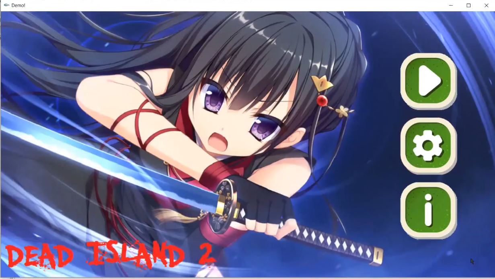</td>
    <td>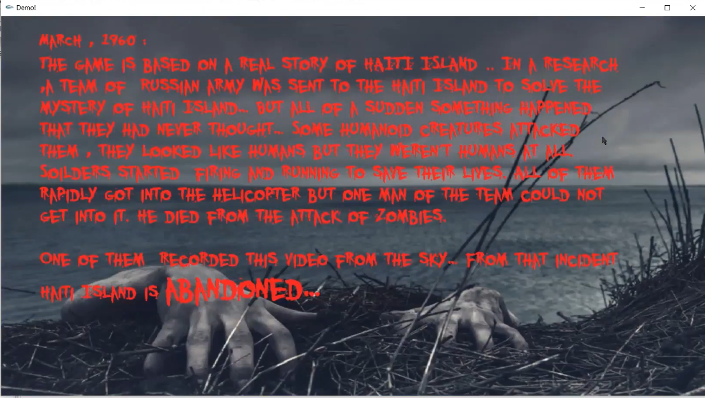</td>
    <td>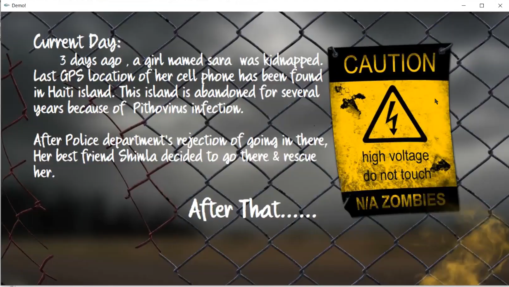</td>
  </tr>
</table>
<table>
  <tr> Some Stages Before Meeting The Charecter Farhan</tr>
  <tr>
    <td>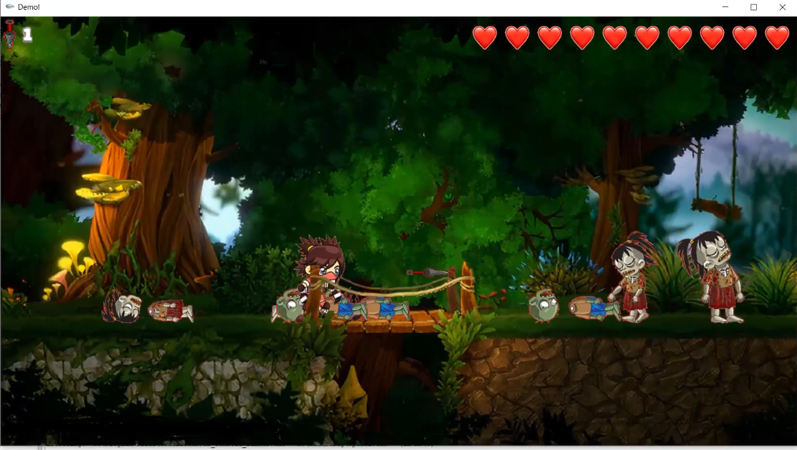</td>
    <td>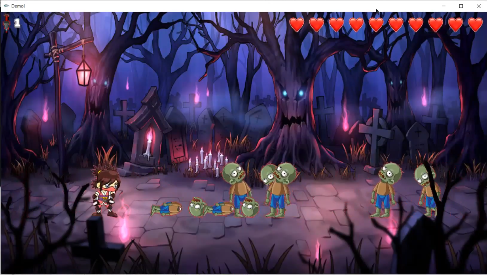</td>
    <td>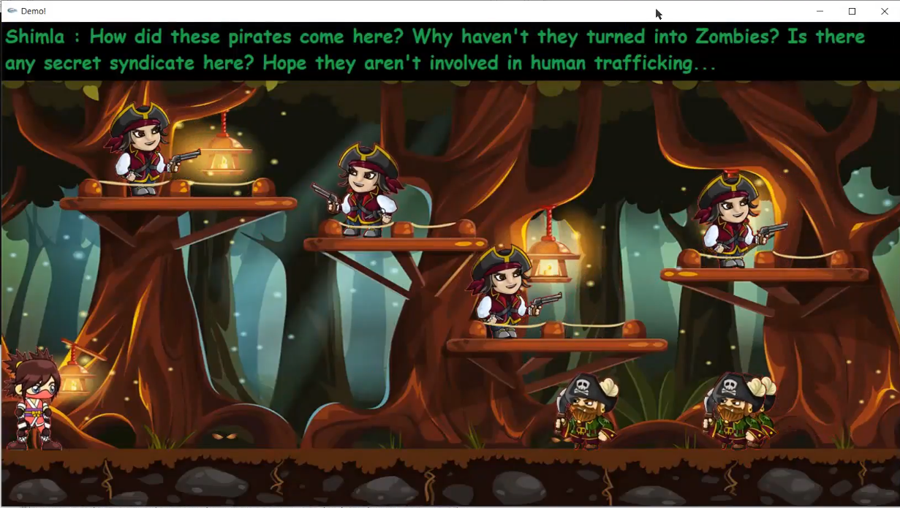</td>
  </tr>
</table>
<table>
  <tr>Fighting and Farhans Entry to The Game</tr>
  <tr>
    <td>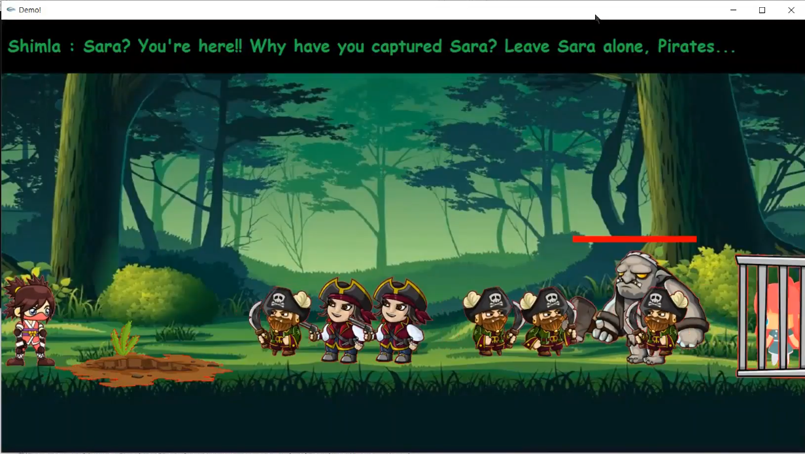</td>
    <td>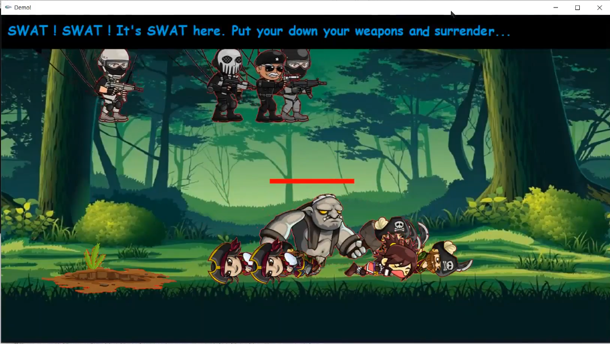</td>
    <td>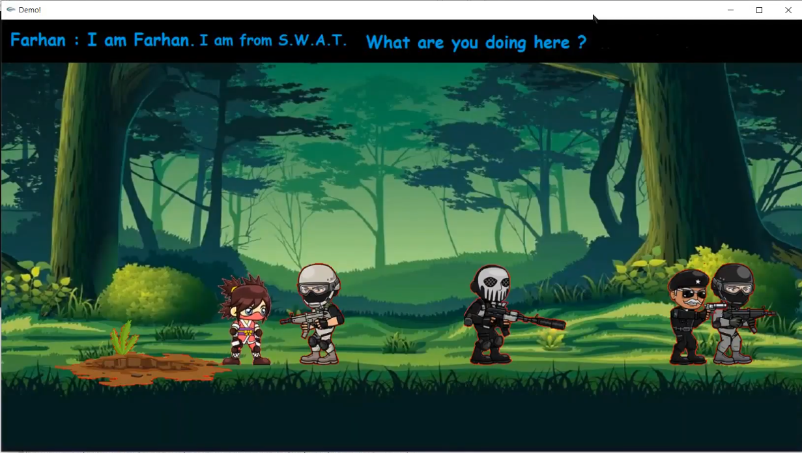</td>
  </tr>
</table>
<table>
  <tr>The Charecter Ashiq Entry and Trainning Stage</tr>
  <tr>
    <td>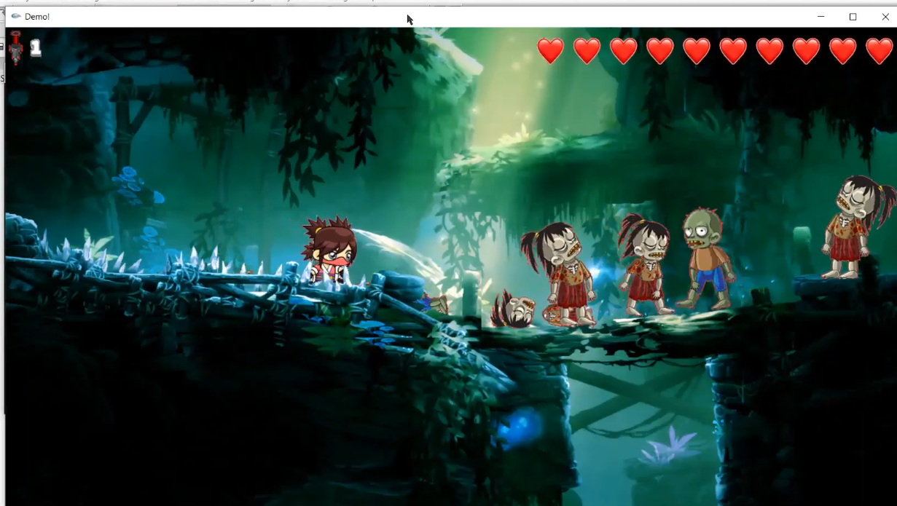</td>
    <td>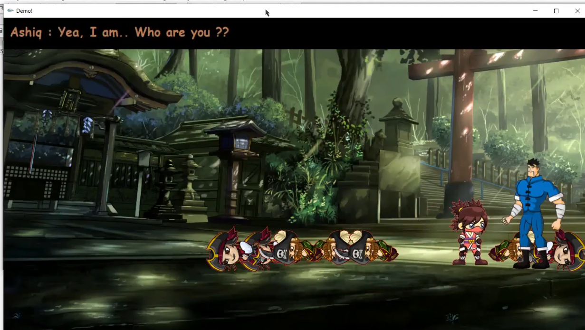</td>
    <td>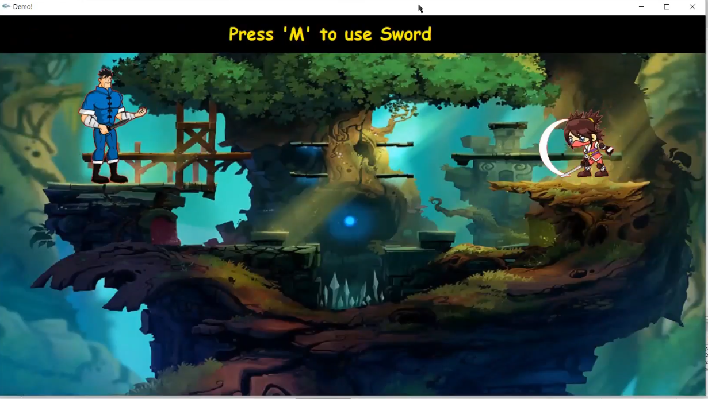</td>
  </tr>
</table>

<table>
  <tr>Some Stages Before the Boss Round</tr>
  <tr>
    <td>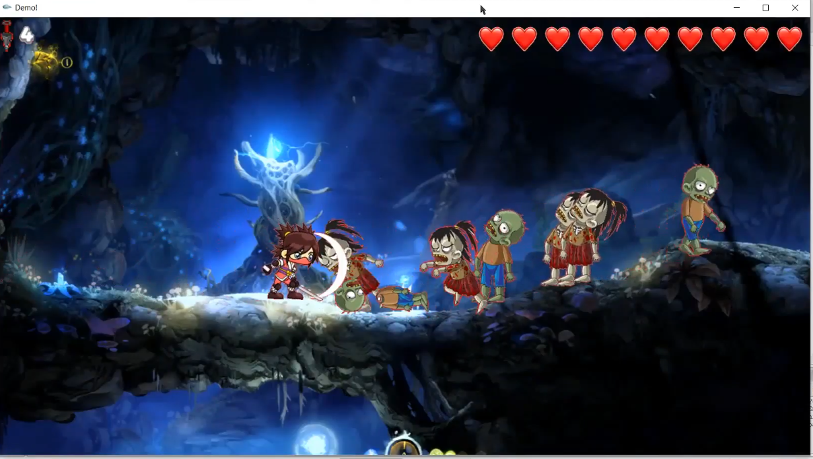</td>
    <td>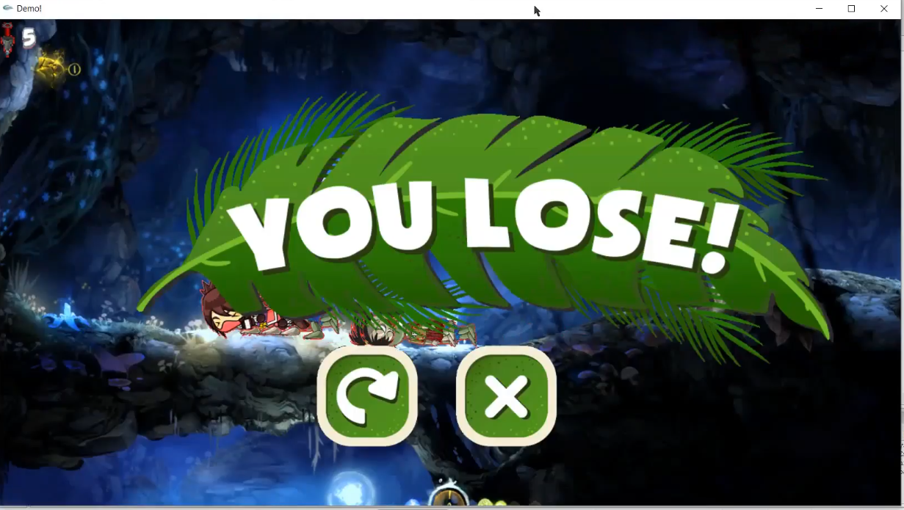</td>
    <td>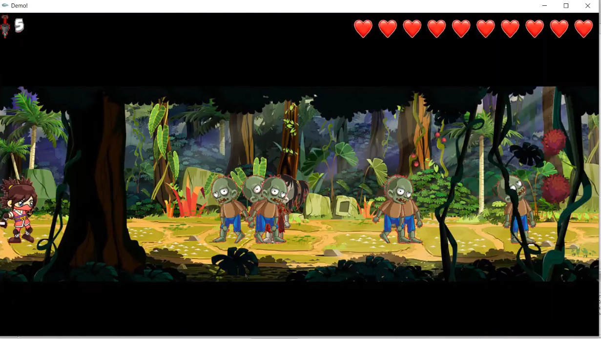</td>
  </tr>
</table>
<table>
  <tr>The Final Fight and Ending</tr>
  <tr>
    <td>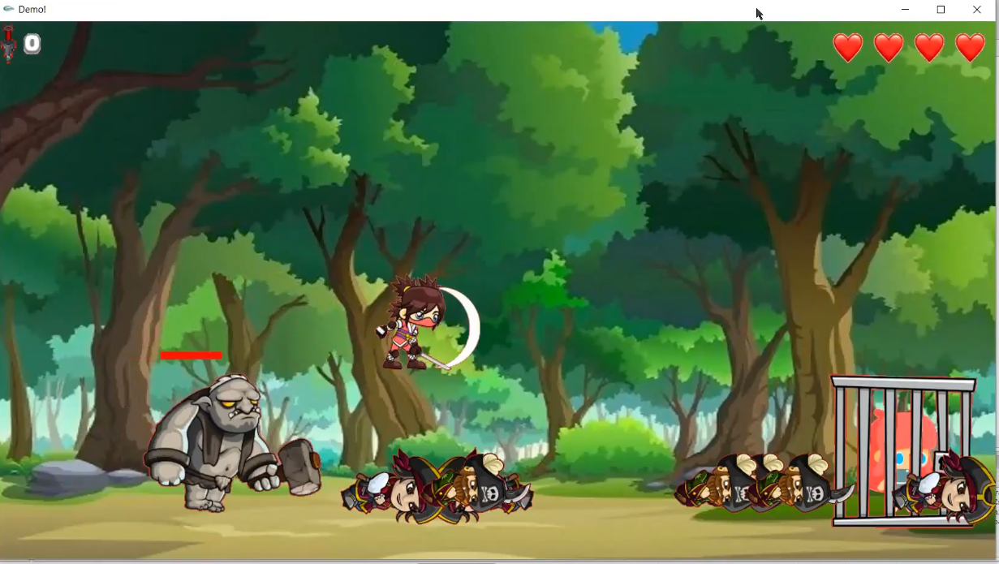</td>
    <td>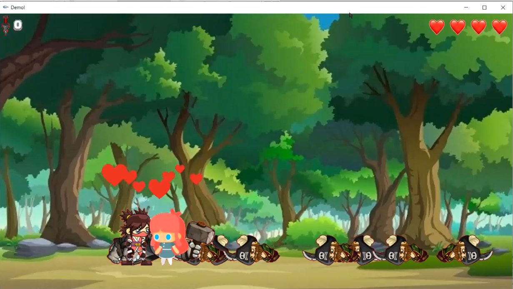</td>
    <td>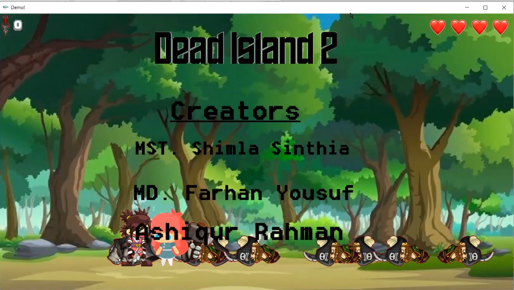</td>
  </tr>
</table>

## 🔧 Installation & Usage
1. **Clone the Repository**  
   ```sh
   git clone https://github.com/yourusername/Dead-Island-2.git
   cd Dead-Island-2
   ```
2. **Compile the Game**  
   - Ensure you have a **C++ compiler** installed.  
   - Link the **iGraphics** and **SFML Audio** libraries properly.  

3. **Run the Game**  
   - Execute the compiled binary file.  

## 👨‍💻 Developers
- **Farhan**  
- **Shimla**  
- **Ashiq**  

## 📜 License
This project is licensed under the **MIT License** – feel free to use and modify it.  

---
🔥 **Get ready to fight for survival in Dead Island 2!** 🔥

